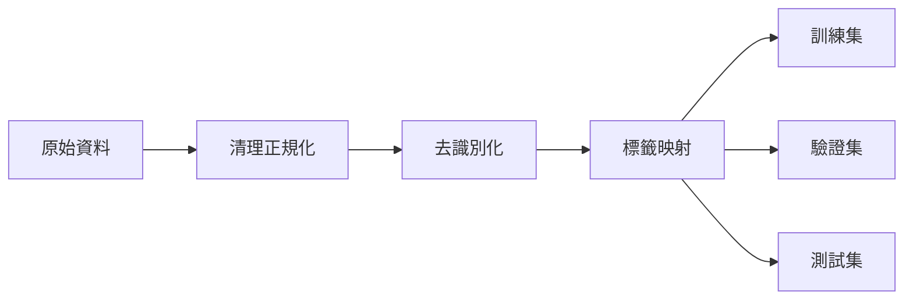

# Data Contract - CyberPuppy 資料規範
**Version**: 1.0.0
**Last Updated**: 2025-09-24
**Status**: Draft

---

## 1. 資料集清單

### 1.1 主要資料集（毒性/霸凌偵測）

#### COLD (Chinese Offensive Language Dataset)
- **用途**: 中文冒犯語言偵測基準
- **來源**: THU-COAI/HIT-SCIR
- **規模**: ~37k samples
- **標籤**: offensive/non-offensive, targeted/untargeted
- **格式**: JSON/CSV

#### SCCD (Session-level Chinese Cyberbullying Dataset)
- **用途**: 會話級霸凌偵測
- **來源**: 微博對話串
- **規模**: TBD (需確認論文)
- **標籤**: session_label, turn_labels
- **格式**: JSON

#### CHNCI (Chinese Cyberbullying Incident Dataset)
- **用途**: 事件級霸凌分析
- **來源**: 社交媒體事件
- **規模**: TBD (需確認論文)
- **標籤**: incident_type, roles, severity
- **格式**: JSON

### 1.2 輔助資料集（情緒分析）

#### ChnSentiCorp
- **用途**: 中文情感二元分類
- **來源**: 酒店評論
- **規模**: ~12k samples
- **標籤**: positive/negative
- **格式**: TSV/CSV

#### DMSC v2 (豆瓣短評)
- **用途**: 情感強度分析
- **來源**: 豆瓣電影短評
- **規模**: ~200k samples
- **標籤**: rating (1-5)
- **格式**: CSV/JSON

#### NTUSD (臺大情感詞典)
- **用途**: 詞彙級情感標註
- **來源**: 學術整理
- **規模**: ~2.8k positive, ~8.2k negative
- **標籤**: positive/negative
- **格式**: TXT

---

## 2. 統一資料欄位 Schema

### 2.1 核心欄位
```json
{
  "id": "string",           // 唯一識別碼 (SHA256 hash)
  "text": "string",         // 原始文本
  "timestamp": "ISO8601",   // 時間戳記
  "source": "string",       // 資料來源 (weibo/douban/hotel)
  "dataset": "string"       // 資料集名稱 (COLD/SCCD/etc.)
}
```

### 2.2 標籤欄位
```json
{
  "toxicity": {
    "label": "enum",        // none|toxic|severe
    "score": "float"        // 0.0-1.0
  },
  "bullying": {
    "label": "enum",        // none|harassment|threat|hate
    "score": "float"        // 0.0-1.0
  },
  "emotion": {
    "label": "enum",        // positive|neutral|negative
    "strength": "int"       // 0-4 (強度)
  }
}
```

### 2.3 脈絡欄位（會話/事件資料）
```json
{
  "thread_id": "string",    // 會話串識別碼
  "turn_id": "int",         // 對話輪次
  "parent_id": "string",    // 父訊息ID
  "user_id": "string",      // 匿名化用戶ID (SHA256)
  "role": "enum",           // perpetrator|victim|bystander|none
  "context": {
    "before": ["string"],   // 前文 (最多3則)
    "after": ["string"]     // 後文 (最多3則)
  }
}
```

### 2.4 metadata 欄位
```json
{
  "processed_at": "ISO8601",
  "version": "string",       // 處理版本
  "flags": {
    "has_emoji": "bool",
    "has_url": "bool",
    "has_mention": "bool",
    "is_simplified": "bool", // 簡體中文
    "is_traditional": "bool" // 繁體中文
  }
}
```

---

## 3. 編碼與正規化規範

### 3.1 字元編碼
- **統一編碼**: UTF-8 (無 BOM)
- **換行符**: LF (\n)
- **檔案格式**: JSON Lines (.jsonl) 為主，CSV 為輔

### 3.2 文字正規化
```python
# 正規化流程
1. 繁簡轉換: OpenCC (s2tw.json / tw2s.json)
2. 全形半形: 統一轉半形（保留中文全形標點）
3. 空白處理: 多空白合併為單一空格
4. 特殊字元: 移除零寬字元 (ZWSP, ZWJ)
5. HTML實體: 解碼 (&amp; → &)
```

### 3.3 表情符號處理
```python
# 表情符號策略
- Unicode Emoji: 保留並標記 (regex: emoji.UNICODE_EMOJI)
- 顏文字: 保留 (如 ^_^, QQ, orz)
- 自訂表情: 轉換為 [emoji:name] 格式
- 統計: 記錄 emoji 數量於 metadata
```

### 3.4 URL 與提及處理
```python
# 隱私保護替換
- URL: https://example.com → [URL]
- Email: user@domain.com → [EMAIL]
- @提及: @username → [MENTION]
- 電話: +886-2-1234-5678 → [PHONE]
- 身分證字號: A123456789 → [ID]
```

---

## 4. 隱私與合規

### 4.1 去識別化原則
- **用戶ID**: SHA256(original_id + salt) 截取前16字元
- **時間模糊**: 僅保留日期，移除精確時間（可選）
- **地理資訊**: 移除所有地理標籤
- **真實姓名**: 使用 NER 偵測並替換為 [NAME]

### 4.2 最小化保留
```yaml
必要保留:
  - 文本內容（去識別化後）
  - 標籤資訊
  - 時序關係（對話串）

不保留:
  - 原始用戶資訊
  - IP 地址
  - 裝置資訊
  - 精確位置
  - 個人照片/影片
```

### 4.3 資料存取控制
```yaml
存取層級:
  public:    # 完全去識別化資料
  internal:  # 包含 thread_id, user_id (hashed)
  restricted: # 原始資料（僅研究用途）

加密要求:
  - 儲存: AES-256 加密 (restricted 層級)
  - 傳輸: HTTPS/TLS 1.3+
  - 備份: 加密壓縮檔
```

### 4.4 合規聲明
- 遵守 GDPR 資料最小化原則
- 符合台灣個資法要求
- 實施資料保留期限（預設 2 年）
- 提供資料刪除請求機制

---

## 5. 資料品質檢查

### 5.1 完整性檢查
```python
required_fields = ['id', 'text', 'dataset', 'timestamp']
assert all(field in record for field in required_fields)
assert len(record['text'].strip()) > 0
assert record['id'] matches r'^[a-f0-9]{16}$'
```

### 5.2 一致性檢查
```python
# 標籤值域
assert toxicity['label'] in ['none', 'toxic', 'severe']
assert 0.0 <= toxicity['score'] <= 1.0
assert emotion['strength'] in range(5)

# 時間邏輯
assert parent_timestamp <= child_timestamp
assert all timestamps are ISO8601 format
```

### 5.3 統計監控
```yaml
監控指標:
  - 缺失值比例 < 5%
  - 重複記錄 < 1%
  - 標籤分布偏斜 < 80/20
  - 文本長度分布（中位數 20-200 字）
  - 異常值偵測（Z-score > 3）
```

---

## 6. 資料版本控制

### 6.1 版本命名
```
dataset_v{major}.{minor}.{patch}_{YYYYMMDD}
例: COLD_v1.2.0_20250124
```

### 6.2 變更日誌
```yaml
v1.0.0 (2025-01-24):
  - 初始版本
  - 整合 COLD + ChnSentiCorp

v1.1.0 (預計):
  - 新增 SCCD 會話資料
  - 優化繁簡轉換邏輯
```

### 6.3 資料血統 (Data Lineage)


---

## 7. 使用範例

### 7.1 資料載入
```python
import json
import pandas as pd
from pathlib import Path

def load_dataset(dataset_name: str, split: str = 'train'):
    path = Path(f'data/processed/{dataset_name}_{split}.jsonl')
    records = []
    with open(path, 'r', encoding='utf-8') as f:
        for line in f:
            records.append(json.loads(line))
    return pd.DataFrame(records)

# 使用
df_cold = load_dataset('COLD', 'train')
print(f"Loaded {len(df_cold)} samples")
```

### 7.2 資料驗證
```python
def validate_record(record: dict) -> bool:
    """驗證單筆資料符合 schema"""
    required = ['id', 'text', 'dataset', 'timestamp']
    if not all(k in record for k in required):
        return False

    if 'toxicity' in record:
        if record['toxicity']['label'] not in ['none', 'toxic', 'severe']:
            return False

    return True

# 批次驗證
invalid = df_cold.apply(validate_record, axis=1)
print(f"Invalid records: {(~invalid).sum()}")
```

---

## 8. 聯絡與維護

**資料管理員**: CyberPuppy Team
**更新頻率**: 季度更新
**問題回報**: GitHub Issues
**最後審核**: 2025-01-24

---

## 附錄 A: 標籤對照表

| 資料集 | 原始標籤 | 統一標籤 | 說明 |
|--------|----------|----------|------|
| COLD | offensive | toxic | 冒犯性言論 |
| COLD | targeted | toxic + targeted | 針對性攻擊 |
| SCCD | cyberbullying | bullying.harassment | 網路霸凌 |
| CHNCI | hate_speech | bullying.hate | 仇恨言論 |
| ChnSentiCorp | 1 | emotion.positive | 正面情感 |
| ChnSentiCorp | 0 | emotion.negative | 負面情感 |
| DMSC | 1-2 | emotion.negative | 低分負評 |
| DMSC | 3 | emotion.neutral | 中性評價 |
| DMSC | 4-5 | emotion.positive | 高分好評 |

---

## 附錄 B: OpenCC 設定檔

```json
{
  "name": "cyberpuppy_tw2s",
  "segmentation": {
    "type": "mmseg",
    "dict": "TSPhrases.txt"
  },
  "conversion_chain": [{
    "type": "simplified",
    "dict": "TWPhrases.txt"
  }, {
    "type": "simplified",
    "dict": "TSCharacters.txt"
  }]
}
```