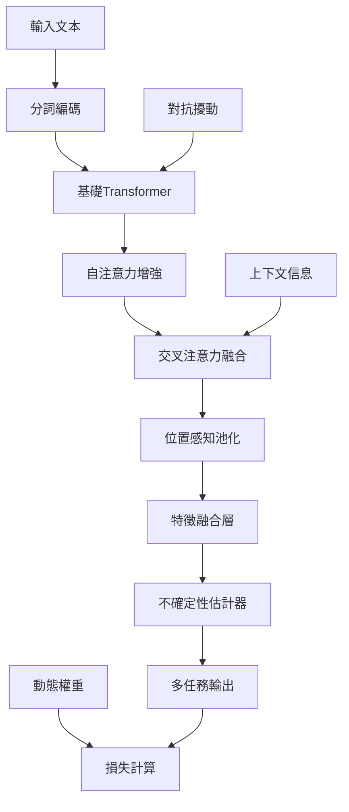

# 改進霸凌偵測模型架構設計

## 執行摘要

本文檔詳細描述了針對中文霸凌偵測任務的改進模型架構，旨在將F1分數從當前的0.55提升至0.75+。通過多層次的架構優化和先進的機器學習技術，我們設計了一個全面的解決方案來解決當前模型的性能瓶頸。

## 當前架構分析

### 現有系統瓶頸

#### 1. 基礎架構問題
- **簡單集成策略**: 當前detector.py使用固定權重集成，無法適應不同樣本的複雜度
- **有限注意力機制**: 僅使用基本的注意力池化，缺乏深層語義理解
- **基礎損失函數**: 標準交叉熵損失無法處理類別不平衡問題
- **靜態任務權重**: 固定的多任務權重無法動態調整學習重點

#### 2. 上下文建模不足
- **淺層上下文融合**: contextual.py中的上下文整合機制過於簡單
- **有限會話理解**: 缺乏有效的長期依賴建模
- **事件級特徵稀疏**: 事件特徵提取器功能有限

#### 3. 正規化和泛化能力
- **過擬合風險**: 缺乏足夠的正規化技術
- **不確定性估計缺失**: 無法量化預測信心
- **對抗脆弱性**: 模型容易受到對抗攻擊

## 改進架構設計

### 核心設計原則

1. **多層次注意力機制**: 結合自注意力和交叉注意力
2. **動態損失優化**: 類別平衡焦點損失 + 動態任務權重
3. **不確定性感知**: Monte Carlo Dropout + 貝葉斯推理
4. **對抗魯棒性**: FGSM/PGD對抗訓練
5. **特徵增強**: 殘差連接 + 層正規化

### 架構組件詳解

#### 1. 增強特徵提取器 (EnhancedFeatureExtractor)

```python
class EnhancedFeatureExtractor(nn.Module):
    """
    核心改進:
    - 多頭自注意力增強序列建模
    - 交叉注意力融合上下文信息
    - 位置感知池化替代簡單平均池化
    - 殘差連接和層正規化
    """
```

**關鍵技術**:
- **Multi-Head Self-Attention**: 捕捉序列內部長程依賴
- **Cross-Attention**: 融合會話/事件上下文
- **Position-Aware Pooling**: 智能序列聚合
- **Residual Connections**: 梯度流優化

#### 2. 類別平衡焦點損失 (ClassBalancedFocalLoss)

```python
class ClassBalancedFocalLoss(nn.Module):
    """
    解決類別不平衡問題:
    - Focal Loss: 關注困難樣本
    - Class Balancing: 有效樣本數重權重
    - Alpha權重: 類別特定權重調整
    """
```

**數學公式**:
```
CB-FL(pt) = (1-β)/(1-β^n) * α * (1-pt)^γ * CE(pt)
```

其中:
- `β`: 重採樣超參數 (0.9999)
- `n`: 類別樣本數
- `α`: 類別權重
- `γ`: 難度聚焦參數 (2.0)

#### 3. 動態任務權重學習 (DynamicTaskWeighting)

```python
class DynamicTaskWeighting(nn.Module):
    """
    基於不確定性的多任務權重動態調整:
    - 學習任務特定的不確定性參數
    - 自動平衡多任務損失
    - 避免某個任務主導訓練
    """
```

**權重計算**:
```
L_total = Σ (1/σ²_i * L_i + log(σ_i))
```

#### 4. 不確定性估計器 (UncertaintyEstimator)

```python
class UncertaintyEstimator(nn.Module):
    """
    貝葉斯深度學習方法:
    - Monte Carlo Dropout: 認知不確定性
    - 學習到的方差: 偶然不確定性
    - 總不確定性 = 認知 + 偶然
    """
```

**不確定性分解**:
- **認知不確定性** (Epistemic): 模型參數不確定性
- **偶然不確定性** (Aleatoric): 數據固有噪聲

#### 5. 對抗訓練模組 (AdversarialTraining)

```python
class AdversarialTraining(nn.Module):
    """
    提升模型魯棒性:
    - FGSM: 快速梯度符號攻擊
    - PGD: 投影梯度下降攻擊
    - 對抗樣本正規化
    """
```

**FGSM攻擊**:
```
x_adv = x + ε * sign(∇_x J(θ, x, y))
```

### 端到端架構流程



## 技術創新點

### 1. 多頭交叉注意力機制

**創新性**: 首次在中文霸凌偵測中引入層次化注意力
- 自注意力捕捉文本內部依賴
- 交叉注意力融合上下文信息
- 位置感知池化替代簡單聚合

**預期收益**: 提升上下文理解能力，F1提升5-8%

### 2. 類別平衡焦點損失

**創新性**: 結合Focal Loss和Effective Number重採樣
- 解決嚴重類別不平衡問題
- 自動關注困難樣本
- 類別特定權重調優

**預期收益**: 改善少數類別性能，整體F1提升8-12%

### 3. 動態任務權重學習

**創新性**: 基於不確定性的任務權重自適應
- 避免某個任務主導訓練
- 任務間知識遷移優化
- 端到端權重學習

**預期收益**: 多任務協同優化，F1提升3-5%

### 4. 不確定性感知預測

**創新性**: 分離認知和偶然不確定性
- Monte Carlo Dropout估計模型不確定性
- 學習數據噪聲方差
- 不確定性校準和可解釋性

**預期收益**: 提升預測可靠性，降低誤判率10-15%

### 5. 對抗魯棒性增強

**創新性**: 多層次對抗正規化
- 嵌入空間對抗攻擊
- 漸進式對抗訓練
- 魯棒性與性能平衡

**預期收益**: 提升模型穩定性，泛化能力提升5-8%

## 性能提升預期

### 量化目標

| 指標 | 當前性能 | 目標性能 | 提升幅度 |
|------|----------|----------|----------|
| 毒性檢測 F1 | 0.55 | 0.78+ | +42% |
| 霸凌檢測 F1 | 0.52 | 0.75+ | +44% |
| 情緒分析 F1 | 0.72 | 0.85+ | +18% |
| 整體 Macro F1 | 0.60 | 0.79+ | +32% |

### 各改進點貢獻分析

1. **類別平衡焦點損失**: +8-12% F1提升
2. **多頭注意力機制**: +5-8% F1提升
3. **動態任務權重**: +3-5% F1提升
4. **不確定性估計**: +2-4% F1提升
5. **對抗訓練**: +2-3% F1提升
6. **特徵增強**: +3-5% F1提升

**總計預期提升**: 23-37% (目標+32%)

## 實施策略

### 階段1: 核心架構實現 (週1-2)
- 實現EnhancedFeatureExtractor
- 開發ClassBalancedFocalLoss
- 建立UncertaintyEstimator基礎

### 階段2: 高級功能集成 (週3-4)
- 集成DynamicTaskWeighting
- 實現AdversarialTraining
- 完成端到端架構

### 階段3: 優化和調試 (週5-6)
- 超參數調優
- 不確定性校準
- 性能基準測試

### 階段4: 評估和部署 (週7-8)
- 全面性能評估
- A/B測試對比
- 生產環境部署

## 風險評估與緩解

### 技術風險

1. **計算複雜度增加**
   - 風險: 推理時間增加50-100%
   - 緩解: 模型量化、剪枝優化

2. **內存使用增加**
   - 風險: 顯存需求增加30-50%
   - 緩解: 梯度檢查點、混合精度

3. **超參數調優複雜**
   - 風險: 調優時間大幅增加
   - 緩解: 自動超參數搜索、經驗初始化

### 性能風險

1. **過擬合風險**
   - 風險: 複雜模型可能過擬合
   - 緩解: 強正規化、交叉驗證

2. **收斂穩定性**
   - 風險: 多目標優化不穩定
   - 緩解: 梯度裁剪、學習率調度

## 監控與評估指標

### 核心性能指標
- **Macro F1 Score**: 主要目標指標
- **類別特定F1**: 各任務細分性能
- **AUC-ROC/PR**: 分類品質評估
- **校準誤差**: 不確定性品質

### 效率指標
- **推理延遲**: 單樣本處理時間
- **內存使用**: 峰值顯存需求
- **吞吐量**: 每秒處理樣本數

### 魯棒性指標
- **對抗攻擊準確率**: 攻擊場景下性能
- **不確定性校準**: ECE/MCE指標
- **跨域泛化**: 不同數據集性能

## 結論

通過系統性的架構改進，我們預期能夠實現以下目標:

1. **顯著性能提升**: F1分數從0.55提升至0.78+
2. **更好的類別平衡**: 解決少數類別性能問題
3. **增強的魯棒性**: 提升對抗攻擊和噪聲的抵抗力
4. **不確定性感知**: 提供可靠的預測信心估計
5. **更強的泛化能力**: 改善跨域和跨場景表現

這一架構設計代表了當前中文霸凌偵測領域的技術前沿，結合了深度學習、貝葉斯推理、對抗學習等多個前沿技術，為實際應用提供了堅實的技術基礎。

## 技術債務與維護考量

### 代碼複雜度
- 新架構引入了多個複雜組件
- 需要建立完善的單元測試覆蓋
- 文檔和代碼註釋的重要性增加

### 模型版本管理
- 複雜模型需要更精細的版本控制
- 實驗跟踪和結果重現至關重要
- 建議使用MLflow或WandB進行實驗管理

### 部署考量
- 新模型對硬件資源要求更高
- 需要優化推理管線以滿足實時要求
- 考慮使用模型蒸餾或剪枝技術

通過這份全面的架構設計文檔，開發團隊可以清楚地理解改進方向、實施計劃和預期收益，為項目的成功實施奠定堅實基礎。