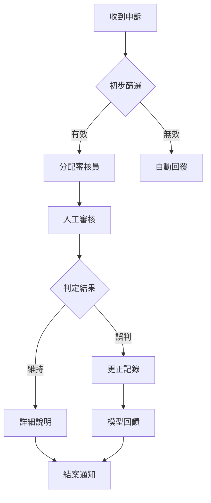

# CyberPuppy 安全政策與運作準則

## 1. 核心原則

### 1.1 使命宣言
CyberPuppy 致力於創造安全、友善的網路環境，透過即時偵測與適當介入，減少網路霸凌對使用者的傷害。

### 1.2 價值觀
- **隱私優先**：保護使用者隱私，最小化資料收集
- **透明可解釋**：提供清晰的判斷依據
- **人性化回應**：以同理心與尊重對待所有使用者
- **持續改進**：從錯誤中學習，不斷優化系統

## 2. 回覆分級策略

### 2.1 第一級：溫和提示 (Gentle Reminder)

**觸發條件**：
- 毒性分數：0.3-0.5
- 首次輕微違規
- 無明確攻擊意圖

**回應方式**：
- 友善的提醒訊息
- 正向引導語言
- 不指責或批判

**範例回應**：
```
「嗨！讓我們保持友善的對話環境吧 😊」
「或許可以用更溫和的方式表達想法呢？」
```

### 2.2 第二級：柔性勸阻 (Soft Intervention)

**觸發條件**：
- 毒性分數：0.5-0.7
- 重複輕微違規（24小時內2次）
- 明顯負面情緒但非惡意

**回應方式**：
- 明確指出問題行為
- 提供替代表達方式
- 簡單的教育內容

**範例回應**：
```
「我們注意到您的訊息可能讓他人感到不舒服。
 網路溝通有時容易產生誤解，試試更清楚地表達您的想法？」
```

### 2.3 第三級：資源提供與升級 (Resource Escalation)

**觸發條件**：
- 毒性分數：0.7-0.9
- 明確霸凌或威脅行為
- 受害者徵兆（尋求幫助）

**回應方式**：
- 提供心理健康資源
- 求助熱線資訊
- 專業協助連結
- 可選擇性通知管理員

**資源列表**：
```
心理健康專線：1925
生命線協談專線：1995
iWIN 網路內容防護：https://i.win.org.tw/
家暴防治專線：113
```

### 2.4 第四級：沉默或移交 (Silent/Handover)

**觸發條件**：
- 毒性分數：>0.9
- 嚴重威脅或犯罪內容
- 多次升級無效（3次以上）

**回應方式**：
- 不直接回應避免激化
- 記錄事件詳情（僅雜湊值）
- 通知人工審核團隊
- 可能的帳號限制建議

## 3. 隱私保護與資料處理

### 3.1 資料最小化原則

**允許收集**：
- 文本雜湊值（SHA-256）
- 毒性分數與分類結果
- 時間戳記
- 會話 ID（匿名化）

**禁止收集**：
- 原始文本內容
- 使用者真實身份
- IP 地址（僅保存前兩段）
- 個人識別資訊（PII）

### 3.2 PII 去識別流程

```python
# PII 類型與處理方式
PII_HANDLERS = {
    'email': '[EMAIL]',
    'phone': '[PHONE]',
    'id_number': '[ID]',
    'credit_card': '[CARD]',
    'address': '[ADDR]',
    'name': '[NAME]'
}
```

### 3.3 日誌記錄規範

**標準日誌格式**：
```json
{
  "timestamp": "2024-01-15T10:30:00Z",
  "event_type": "toxicity_detected",
  "hash": "a1b2c3d4e5f6",
  "scores": {
    "toxicity": 0.75,
    "bullying": 0.60
  },
  "action_taken": "soft_intervention",
  "session_id": "sess_anonymous_123"
}
```

**禁止記錄項目**：
- 原始訊息內容
- 使用者姓名或暱稱
- 詳細位置資訊
- 關聯的社交媒體帳號

## 4. 誤判處理與上訴流程

### 4.1 上訴管道

**使用者申訴入口**：
- 系統內建申訴按鈕
- 電子郵件：appeals@cyberpuppy.org
- 申訴表單：/appeal

**申訴資訊要求**：
- 事件時間（大約）
- 事件類型（誤判類別）
- 簡短說明（可選）
- 聯絡方式（用於回覆）

### 4.2 人工複核流程



### 4.3 審核標準

**誤判認定條件**：
1. 明顯的文化或語境誤解
2. 諷刺或幽默被誤判
3. 學術討論被誤判
4. 引用或報導被誤判

**處理時限**：
- 一般申訴：3 個工作天
- 緊急申訴：24 小時內
- 批量誤判：5 個工作天

### 4.4 補償機制

**誤判補償**：
- 清除相關違規記錄
- 恢復帳號完整權限
- 公開道歉（如需要）
- 提供申訴成功證明

## 5. 特殊情況處理

### 5.1 自傷傾向偵測

**識別指標**：
- 自殺相關關鍵詞
- 絕望情緒表達
- 告別訊息模式

**處理方式**：
- 立即提供求助資源
- 溫暖支持性回應
- 不判斷、不批評
- 可選通知緊急聯絡人

### 5.2 未成年人保護

**額外保護措施**：
- 降低觸發閾值（更敏感）
- 優先提供教育內容
- 家長通知選項（需同意）
- 限制資料保存期限

### 5.3 文化敏感性

**考量因素**：
- 地區俚語差異
- 文化表達習慣
- 世代用語差異
- 特定社群用語

## 6. 透明度報告

### 6.1 定期公開資訊

**每月報告內容**：
- 處理訊息總數（僅數量）
- 各級回應比例
- 誤判率統計
- 申訴處理統計

**每季改進報告**：
- 模型準確度提升
- 新增保護機制
- 使用者回饋整理
- 政策調整說明

### 6.2 外部稽核

**稽核機制**：
- 年度第三方隱私稽核
- 演算法公平性評估
- 使用者滿意度調查
- 專家諮詢委員會

## 7. 緊急應變計劃

### 7.1 大規模誤判事件

**應變步驟**：
1. 立即暫停自動處罰
2. 啟動人工審核模式
3. 快速修正模型
4. 主動通知受影響使用者
5. 事後檢討報告

### 7.2 隱私洩露事件

**處理流程**：
1. 立即停止資料收集
2. 評估影響範圍
3. 72小時內通報
4. 提供補救措施
5. 強化安全機制

## 8. 持續改進機制

### 8.1 回饋循環

```
使用者回饋 → 誤判分析 → 模型調整 → A/B 測試 → 全面部署
     ↑                                                ↓
     ←─────────────── 效果評估 ←──────────────────────
```

### 8.2 模型更新原則

**更新觸發條件**：
- 誤判率超過 5%
- 新型霸凌模式出現
- 重大社會事件影響
- 定期維護（每季）

**更新前測試**：
- 離線測試集驗證
- 小規模 A/B 測試
- 人工抽樣檢查
- 偏見檢測分析

## 9. 法律合規

### 9.1 遵循法規

- 個人資料保護法
- 兒童線上隱私保護法
- 通訊保障及監察法
- 各地區相關法規

### 9.2 執法配合

**配合原則**：
- 僅在法院命令下提供資料
- 最小必要資訊原則
- 通知使用者（除非禁止）
- 透明度報告揭露

## 10. 聯絡資訊

**一般查詢**：support@cyberpuppy.org
**隱私相關**：privacy@cyberpuppy.org
**申訴上訴**：appeals@cyberpuppy.org
**媒體聯絡**：press@cyberpuppy.org
**安全通報**：security@cyberpuppy.org

---

*本政策最後更新日期：2024年1月*
*下次檢視日期：2024年4月*