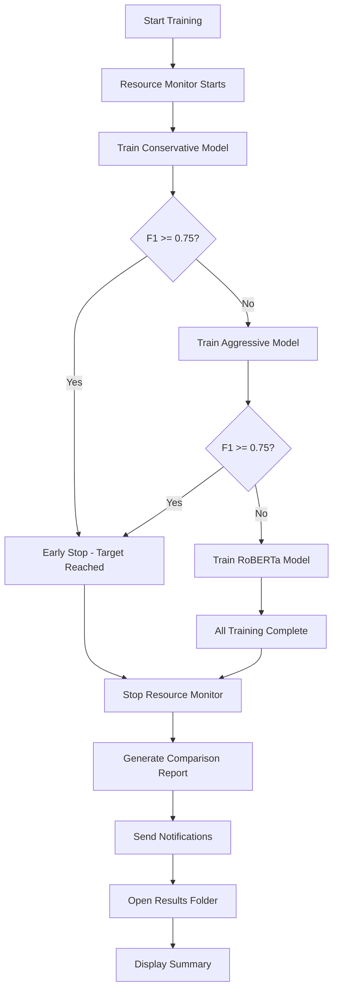

# CyberPuppy Training Automation 🤖

Complete hands-off training automation system for CyberPuppy models. Set it up once, then let it train while you sleep! 💤

## 🚀 Quick Start

### Option 1: Interactive Setup
```bash
# Run the setup wizard
scripts\setup_automation.bat
```

### Option 2: Manual Setup
```bash
# Immediate training
scripts\train_all_models.bat

# Schedule overnight training (11 PM daily)
python scripts\schedule_training.py create --time 23:00 --frequency daily
```

## 🎯 Features

### ✅ **Fully Automated Training Pipeline**
- **Sequential Training**: Conservative → Aggressive → RoBERTa (stops at F1 ≥ 0.75)
- **Early Stopping**: Automatically stops when target reached
- **Resource Monitoring**: Real-time CPU/Memory/GPU tracking
- **Comprehensive Logging**: Every step tracked and logged

### 📊 **Intelligent Model Comparison**
- **HTML Reports**: Beautiful comparison reports with charts
- **Performance Metrics**: F1, Precision, Recall, Accuracy
- **Visual Charts**: Radar plots, bar charts, training curves
- **Best Model Selection**: Automatic identification of top performer

### 🔔 **Multi-Channel Notifications**
- **Desktop Notifications**: Windows toast notifications
- **Email Alerts**: Optional SMTP email notifications
- **Sound Notifications**: Success/failure audio feedback
- **Webhook Support**: Slack, Discord, custom webhooks

### ⚡ **Resource Management**
- **Real-time Monitoring**: CPU, Memory, Disk, GPU usage
- **Smart Alerts**: Threshold-based warnings
- **Performance Tracking**: Historical resource usage
- **Automatic Cleanup**: Handles errors gracefully

### 🕒 **Flexible Scheduling**
- **Windows Task Scheduler**: Native OS integration
- **Multiple Schedules**: Daily, weekly, custom timing
- **Wake Computer**: Automatically wakes sleeping PCs
- **Robust Execution**: Handles system restarts

## 📁 File Structure

```
scripts/
├── train_all_models.bat          # Main training orchestrator
├── compare_models.py              # Model comparison & HTML reports
├── schedule_training.py           # Windows Task Scheduler integration
├── resource_monitor.py            # System resource monitoring
├── send_notifications.py          # Multi-channel notifications
├── extract_metrics.py             # Metrics extraction utilities
├── setup_automation.bat          # Interactive setup wizard
└── README_AUTOMATION.md          # This documentation

logs/                              # All logs stored here
├── training_YYYYMMDD_HHMMSS.log  # Main training log
├── resource_monitor_[session].log # Resource monitoring
├── alerts_[session].log          # Resource alerts
└── resource_summary_[session].json # Resource usage summary

models/                            # Trained models & results
├── conservative_[timestamp]/      # Conservative model
├── aggressive_[timestamp]/        # Aggressive model
├── roberta_[timestamp]/          # RoBERTa model
├── comparison_report_[session].html # HTML comparison report
└── comparison_data_[session].json # Raw comparison data

config/
└── notifications.json            # Notification settings
```

## 🛠️ Setup & Configuration

### 1. **Initial Setup**
```bash
# Quick setup with wizard
scripts\setup_automation.bat

# Or manual dependency install
pip install psutil matplotlib seaborn pandas plyer requests pygame
```

### 2. **Configure Notifications**
Edit `config/notifications.json`:

```json
{
  "desktop_notifications": {
    "enabled": true,
    "duration": 10
  },
  "email_notifications": {
    "enabled": true,
    "smtp_server": "smtp.gmail.com",
    "smtp_port": 587,
    "sender_email": "your-email@gmail.com",
    "sender_password": "your-app-password",
    "recipient_emails": ["recipient@example.com"]
  },
  "sound_notifications": {
    "enabled": true
  },
  "custom_notifications": {
    "enabled": false,
    "slack_webhook": "https://hooks.slack.com/...",
    "discord_webhook": "https://discord.com/api/webhooks/..."
  }
}
```

### 3. **Schedule Training**
```bash
# Daily at 11 PM
python scripts\schedule_training.py create --time 23:00 --frequency daily

# Weekly on weekends
python scripts\schedule_training.py create --time 20:00 --frequency weekly

# One-time run
python scripts\schedule_training.py create --time 12:00 --frequency once
```

## 📋 Usage Examples

### **Immediate Training**
```bash
# Start training now (all 3 configurations)
scripts\train_all_models.bat
```

### **Scheduled Training Management**
```bash
# List all scheduled tasks
python scripts\schedule_training.py list

# Enable/disable scheduled task
python scripts\schedule_training.py enable
python scripts\schedule_training.py disable

# Run scheduled task immediately
python scripts\schedule_training.py run

# Get detailed task information
python scripts\schedule_training.py info

# Delete scheduled task
python scripts\schedule_training.py delete
```

### **Notifications Testing**
```bash
# Test all notification systems
python scripts\send_notifications.py --session-id test --status SUCCESS_EARLY --test

# Send specific notification
python scripts\send_notifications.py --session-id test --status SUCCESS_COMPLETE --best-config roberta --best-f1 0.85
```

### **Manual Model Comparison**
```bash
# Compare models from a specific session
python scripts\compare_models.py --session-id 20241027_143022 --best-config aggressive --best-f1 0.82

# Extract specific metric from model
python scripts\extract_metrics.py --model-dir models\conservative_20241027_143022 --metric f1_macro

# Extract all metrics and save summary
python scripts\extract_metrics.py --model-dir models\roberta_20241027_143022 --all-metrics --save-summary
```

### **Resource Monitoring**
```bash
# Start resource monitoring manually
python scripts\resource_monitor.py --session-id manual_session --interval 30

# Custom thresholds
python scripts\resource_monitor.py --session-id test --cpu-threshold 80 --memory-threshold 75
```

## 🎯 Training Flow



## 📊 Output Files

### **Training Session Results**
After each training session, you'll find:

1. **Main Training Log**: `logs/training_YYYYMMDD_HHMMSS.log`
   - Complete training output
   - Model performance metrics
   - Error messages and debugging info

2. **HTML Comparison Report**: `models/comparison_report_[session].html`
   - Beautiful visual comparison
   - Interactive charts and metrics
   - Performance recommendations

3. **Trained Models**: `models/[config]_[timestamp]/`
   - Model files and checkpoints
   - Individual metrics and results
   - Training history and logs

4. **Resource Monitoring**: `logs/resource_monitor_[session].log`
   - CPU, Memory, GPU usage over time
   - Performance bottlenecks
   - Resource alerts and warnings

### **Sample HTML Report Features**
- 📊 **F1 Score Comparison Charts**
- 🎯 **Multi-metric Radar Plots**
- 📈 **Training Loss Curves**
- 🏆 **Best Model Identification**
- 💡 **Performance Recommendations**
- 📋 **Detailed Metrics Tables**

## 🔧 Troubleshooting

### **Common Issues**

1. **Training Fails to Start**
   ```bash
   # Check Python environment
   python --version

   # Verify project structure
   dir scripts\
   dir data\
   ```

2. **Scheduled Task Not Running**
   ```bash
   # Check task status
   python scripts\schedule_training.py info

   # Verify task permissions
   # Run Command Prompt as Administrator
   ```

3. **Notifications Not Working**
   ```bash
   # Test notification systems
   python scripts\send_notifications.py --session-id test --test

   # Check notification config
   type config\notifications.json
   ```

4. **Resource Monitoring Issues**
   ```bash
   # Install monitoring dependencies
   pip install psutil GPUtil nvidia-ml-py3

   # Test resource detection
   python -c "import psutil; print(psutil.cpu_percent())"
   ```

### **Log Analysis**
Check these files when troubleshooting:
- `logs/training_[timestamp].log` - Main training output
- `logs/resource_monitor_[session].log` - Resource usage
- `logs/alerts_[session].log` - System alerts
- Windows Event Viewer - Scheduled task execution

## 🚀 Advanced Usage

### **Custom Training Configurations**
Modify `scripts/train_all_models.bat` to:
- Add new model configurations
- Change training order
- Adjust early stopping thresholds
- Add custom validation steps

### **Email Configuration for Gmail**
1. Enable 2-Factor Authentication
2. Generate App Password
3. Use App Password in `notifications.json`

### **Webhook Integration**
Configure Slack/Discord webhooks for team notifications:
```json
{
  "custom_notifications": {
    "enabled": true,
    "slack_webhook": "https://hooks.slack.com/services/YOUR/SLACK/WEBHOOK",
    "discord_webhook": "https://discord.com/api/webhooks/YOUR/DISCORD/WEBHOOK"
  }
}
```

### **Resource Threshold Tuning**
Adjust monitoring thresholds in `scripts/resource_monitor.py`:
```python
self.thresholds = {
    'cpu_percent': 85.0,      # Lower for earlier warnings
    'memory_percent': 80.0,   # Adjust based on your system
    'disk_percent': 95.0,     # Higher for more disk usage
    'gpu_memory_percent': 90.0
}
```

## 🎉 Hands-Off Workflow

**Perfect for overnight training:**

1. **Setup Once**:
   ```bash
   scripts\setup_automation.bat
   # Choose option 2: Schedule overnight training
   ```

2. **Go to Sleep** 😴
   - Computer will wake at scheduled time
   - Training runs automatically
   - Resource monitoring prevents issues
   - Early stopping saves time

3. **Wake Up to Results** ☀️
   - Desktop notification shows completion
   - HTML report ready for review
   - Best model automatically identified
   - All logs and metrics saved

**That's it! Complete hands-off model training.** 🚀

---

## 📞 Support

For issues or questions:
1. Check the logs in `logs/` directory
2. Review this documentation
3. Test individual scripts with `--help` flag
4. Check Windows Event Viewer for scheduled task issues

**Happy automated training!** 🤖✨